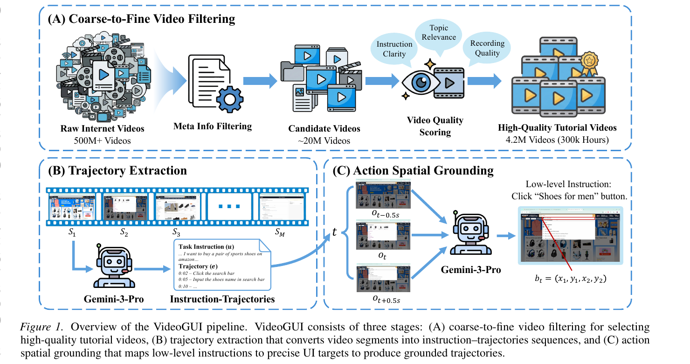
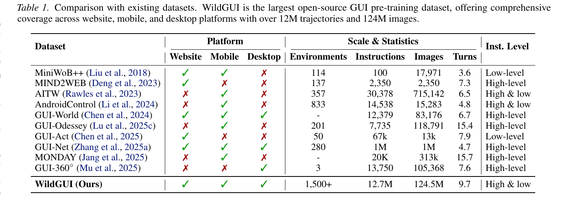
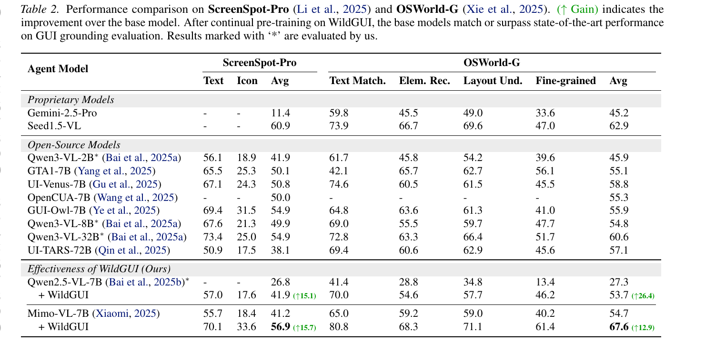
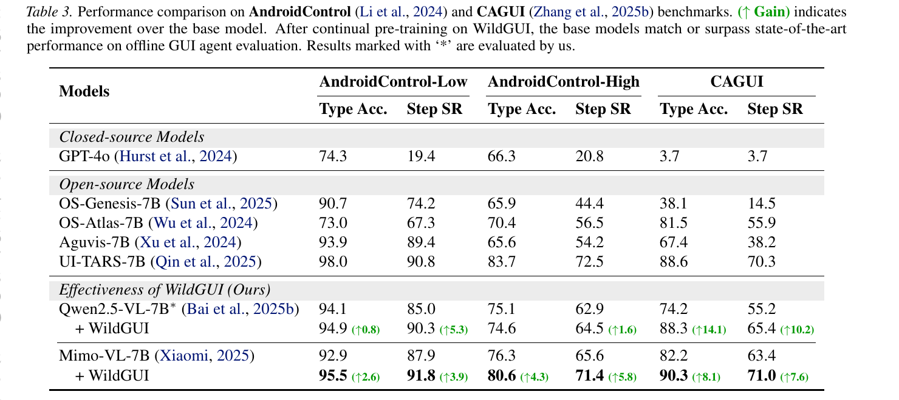

<h1 align="center">
Video2GUI: Synthesizing Large-Scale Interaction Trajectories<br>for Generalized GUI Agent Pretraining
</h1>

<div align="center">


</div>

<p align="center">
  <a href="https://arxiv.org/abs/2605.14747"><b>[📜 arXiv]</b></a> •
  <a href="https://huggingface.co/datasets/xwm/WildGUI"><b>[🤗 WildGUI Dataset]</b></a> •
  <a href="https://github.com/WeiminXiong/Video2GUI"><b>[🐱 GitHub]</b></a>
</p>

This repository contains the code and data for the paper **"Video2GUI: Synthesizing Large-Scale Interaction Trajectories for Generalized GUI Agent Pretraining"**, accepted at **ICML 2026**.

<p align="center">

</p>

Recent advances in multimodal large language models have driven growing interest in graphical user interface (GUI) agents, yet their generalization remains constrained by the scarcity of large-scale training data spanning diverse real-world applications. Existing datasets rely heavily on costly manual annotations and are typically confined to narrow domains.

To address this, we propose **Video2GUI**, a fully automated framework that extracts grounded GUI interaction trajectories directly from unlabeled Internet videos. Applying this pipeline to **500M+ video metadata entries**, we construct **WildGUI**, a large-scale dataset containing **12M interaction trajectories** spanning over **1,500 applications and websites**. Pre-training Qwen2.5-VL and MiMo-VL on WildGUI yields consistent improvements of **5–20%** across multiple GUI grounding and action benchmarks, matching or surpassing state-of-the-art performance.

## 🔥 News

- **[2026/06/14]** 🔥 The **WildGUI** dataset is fully open-sourced on 🤗 HuggingFace — [annotations + screenshots](https://huggingface.co/datasets/xwm/WildGUI).
- **[2026/05/01]** 🎉 Video2GUI has been accepted to **ICML 2026**!

## 📅 Come Find Us at ICML 2026

We will present Video2GUI as a **poster** at ICML 2026 — come and chat with us!

- **🗓️ When:** Thursday, July 9, 2026 · 9:30 AM – 11:15 AM CST
- **📍 Where:** Hall A

## 🧭 Method Overview

Video2GUI is a fully automated, three-stage pipeline that turns unlabeled Internet videos into grounded GUI interaction trajectories suitable for pretraining generalized GUI agents (see the figure above).

- **(A) Coarse-to-Fine Video Filtering.** Starting from 500M+ raw Internet videos, we apply meta-info filtering with a fine-tuned Qwen2.5-7B classifier (trained on DeepSeek-V3 annotations) to select ∼20M candidates, then a fine-grained content-based scorer rating instruction clarity, topic relevance, and screen-recording quality — yielding **4.2M high-quality tutorial videos (∼300k hours)**.
- **(B) Trajectory Extraction.** Each video is split into ≤4-minute segments and processed by Gemini-3-Pro under a sliding-window strategy with historical context, producing instruction–trajectory pairs with task instructions, action timestamps, action details, and visually grounded low-level instructions.
- **(C) Action Spatial Grounding.** For each interaction at timestamp *t*, we feed Gemini-3-Pro a triplet of high-resolution screenshots {*o*<sub>t−0.5s</sub>, *o*<sub>t</sub>, *o*<sub>t+0.5s</sub>} with the low-level instruction and predict the grounding target *b*<sub>t</sub> = (*x*₁, *y*₁, *x*₂, *y*₂). Manual verification on 200 sampled actions shows **>95%** are correctly parameterized.

## 📦 WildGUI Dataset

WildGUI is the largest open-source GUI pre-training dataset to date, with comprehensive coverage across **web, mobile, and desktop** platforms. It is released across two HuggingFace repositories:

<p align="center">

</p>

| Repository | Annotations | Screenshots |
|---|---|---|
| [`xwm/WildGUI`](https://huggingface.co/datasets/xwm/WildGUI) | **All** parts (`part1`–`part19`, JSONL) | `part1`–`part15` |
| [`joker-112/WildGUI_Screenshots`](https://huggingface.co/datasets/joker-112/WildGUI_Screenshots) | — | `part16`–`part19` |

The annotations for every part live in `xwm/WildGUI`; the screenshot frames are split between the two repos. Each annotation record is a single GUI task with an ordered action trajectory, and each action points at one screenshot frame stored as `{video_id}/screenshot_{MM_SS}.jpg` inside the packed tar shards. See each dataset card for the full field schema and the annotation↔screenshot linking convention.

```python
from datasets import load_dataset

# Annotations (all parts)
dataset = load_dataset("xwm/WildGUI", data_files="wildgui_part*.jsonl", split="train")
```

```bash
# Screenshots for one part (e.g. part1), then unpack the tar shards
hf download xwm/WildGUI --repo-type dataset --include "screenshots/part1/*" --local-dir ./wildgui
for t in ./wildgui/screenshots/part1/*.tar; do tar -xf "$t" -C ./wildgui_frames; done
```

## 📊 Results

Pre-training on WildGUI yields consistent gains on the GUI grounding and action benchmarks.

<p align="center">

</p>

<p align="center">

</p>

## 📖 Citation

If you find this work helpful, please cite our paper:

```bibtex
@inproceedings{xiong2026video2gui,
  title     = {Video2GUI: Synthesizing Large-Scale Interaction Trajectories for Generalized GUI Agent Pretraining},
  author    = {Xiong, Weimin and Gu, Shuhao and Ye, Bowen and Yue, Zihao and Li, Lei and Song, Feifan and Li, Sujian and Tian, Hao},
  booktitle = {International Conference on Machine Learning (ICML)},
  year      = {2026},
  url       = {https://arxiv.org/abs/2605.14747}
}
```

## 📧 Contact

For questions, please contact: wmxiong@pku.edu.cn, lisujian@pku.edu.cn

## License

This repository is released under the [Apache License 2.0](./LICENSE).
